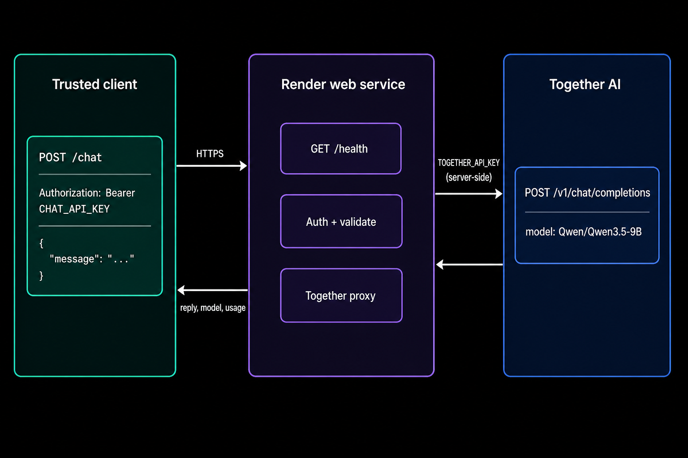

<div align="center">

# Together chat API on Render (TypeScript)

Authenticated single-turn `POST /chat` backed by [Together AI](https://docs.together.ai/docs/render-chat-api), running as a Render web service. Express forwards one user message to chat completions and returns the reply, model ID, and token usage. The landing page keeps a browser-side thread and sends it to `POST /ui/chat`.

<p>
  <a href="https://render.com/deploy?repo=https://github.com/ojusave/together-render-chat-ts">
    
  </a>
</p>

<p>
  <a href="https://render.com">
    
  </a>
  <a href="https://docs.together.ai/docs/render-chat-api">
    
  </a>
  <a href="https://github.com/ojusave/together-render-chat-python">
    
  </a>
</p>

</div>

## What This Template Shows

The Blueprint is the TypeScript path from Together's [Build a chat API on Render](https://docs.together.ai/docs/render-chat-api) guide, flattened into its own repo so the Deploy button can point at a single `render.yaml`.

| Piece | Role |
| --- | --- |
| **[Together AI chat completions](https://docs.together.ai/docs/inference/chat/overview)** | Server-side inference with `TOGETHER_API_KEY` |
| **[Render web service](https://render.com/docs/web-services)** | Public HTTPS, health checks, `0.0.0.0:$PORT` |
| **`CHAT_API_KEY`** | Separate bearer token for callers of `POST /chat` |

## Architecture




### How It Works

1. A trusted client sends `Authorization: Bearer $CHAT_API_KEY` and `{"message":"..."}` to `POST /chat`.
2. The service rejects missing or oversized messages before it spends Together credits.
3. It calls `https://api.together.ai/v1/chat/completions` with a 60 second timeout.
4. It returns `{ model, reply, usage }` or an explicit 401 / 400 / 502 / 504.

| Resource | Type | Plan | Notes |
| --- | --- | --- | --- |
| `together-chat-ts` | Web service | Starter | Always-on paid instance |

Default region: **Oregon** unless you change it in the Dashboard. This service stores no chat history.

## Quick Start

### Prerequisites

- A [Render account](https://dashboard.render.com/register?utm_source=github&utm_medium=referral&utm_campaign=ojus_demos&utm_content=readme_link)
- A [Together AI](https://api.together.ai/) account with an active credit balance and a project API key
- A caller secret: `openssl rand -hex 32` (this is `CHAT_API_KEY`, not the Together key)

### Deploy

1. Click **Deploy to Render** above.
2. Paste `TOGETHER_API_KEY` and `CHAT_API_KEY` when Render prompts for secrets.
3. Wait until the service is **Live** (about 2 to 4 minutes on first build).
4. Open the service URL. The page chats using the Together key already on the service.
5. For the HTTP API, send `Authorization: Bearer $CHAT_API_KEY` to `POST /chat`.

```bash
export SERVICE_URL="https://together-chat-ts-xxxx.onrender.com"

curl "$SERVICE_URL/health"

read -s CHAT_API_KEY
export CHAT_API_KEY

curl -X POST "$SERVICE_URL/chat" \
  -H "Authorization: Bearer $CHAT_API_KEY" \
  -H "Content-Type: application/json" \
  -d '{"message":"In one sentence, what is a vector database?"}'

unset CHAT_API_KEY
```

Do not embed `CHAT_API_KEY` in browser or mobile app code. The shared token is a server-to-server guard for this demo.

## Features

| Feature | Description |
| --- | --- |
| **Authenticated chat** | `POST /chat` requires a bearer token compared with `timingSafeEqual` |
| **Public health check** | `GET /health` is unauthenticated so Render can probe it |
| **Upstream mapping** | Together 4xx/5xx become 502; 60s timeouts become 504 |
| **Swap the model** | Change `TOGETHER_MODEL` in the Dashboard and redeploy |

## Configuration

| Variable | Source | Description |
| --- | --- | --- |
| `TOGETHER_API_KEY` | Required | Project-scoped Together API key |
| `CHAT_API_KEY` | Required | Bearer token callers use against this service |
| `TOGETHER_MODEL` | Optional | Defaults to `Qwen/Qwen3.5-9B` |
| `PORT` | Wired | Set by Render; the server binds `0.0.0.0:$PORT` |

## Cost

| Resource | Approx. monthly |
| --- | ---: |
| Web service (Starter) | ~$7 |
| Together inference | Billed by Together |

Starter stays up. Together usage is separate from Render hosting.

## Troubleshooting

| Problem | Solution |
| --- | --- |
| Deploy asks for secrets | `TOGETHER_API_KEY` and `CHAT_API_KEY` are `sync: false`. Enter them on first Blueprint apply. |
| Health check fails | Confirm the process listens on `0.0.0.0` and `PORT`, and that both secrets are set so the process can start. |
| `401` on `/chat` | Send `Authorization: Bearer` plus the same `CHAT_API_KEY` value stored on the service. |
| `502` with `upstreamStatus` | Together rejected the call. Check the key, model ID, and Together credit balance. |
| Slow first request | Confirm the service is Live and that `TOGETHER_API_KEY` is set. |

## Project Structure

```
render.yaml       Render Blueprint
server.ts         Express health + chat handler
public/           Landing page (Deploy / Sign up / tester)
static/images/    Architecture diagrams
package.json      Node 22–24, Express 5
```

## Learn More

**Render:**
- [Web services](https://render.com/docs/web-services)
- [Deploy to Render button](https://render.com/docs/deploy-to-render-button)
- [Free plan limits](https://render.com/docs/free)

**Upstream:**
- [Build a chat API on Render](https://docs.together.ai/docs/render-chat-api)
- [Chat completions](https://docs.together.ai/docs/inference/chat/overview)

Python sibling: [together-render-chat-python](https://github.com/ojusave/together-render-chat-python).

## License

[MIT](LICENSE)
